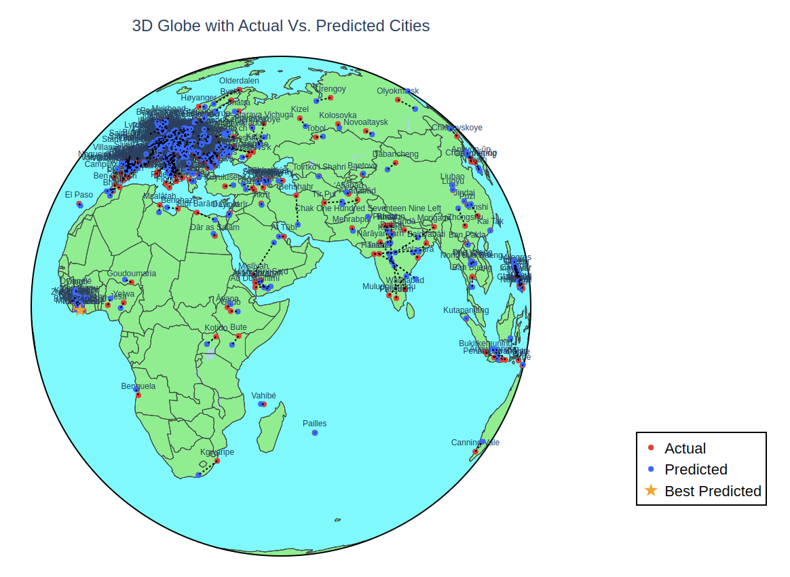

# City Predictor

**Abstact**
A company aims to build a new development and needs to identify the most suitable city that meets specific criteria such as high population, low elevation, and other relevant parameters. The objective of this project is to develop and utilize a machine-learning predictive model that can analyze various city attributes and recommend the best city globally for the company’s project based on the provided criteria.

**Please View Video Demo (1m:18s)!**

**[Link] (https://www.youtube.com/watch?v=SAnjm8y8Jd0)**

# Project Execution

Run using: 

python3 "Name of file"

## Required Library installations
- "pip install geopy"
- "pip install mplcursors"
- "pip install basemap basemap-data-hires geopandas"
- "pip install plotly"
- May need to install additional libraries (Ex. matplotlib, pandas, numpy, etc.)

## Order of Execution
1. 00-visualize_outliers.py
2. 01-preprocessing.py
3. 02-eval_model.py
4. 03-generate_plot.py
    - User input into command line is required for num of data points on map.

* *Program was built and tested using Linux OS*